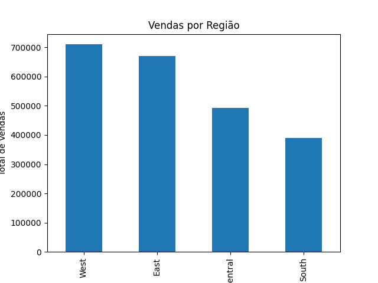
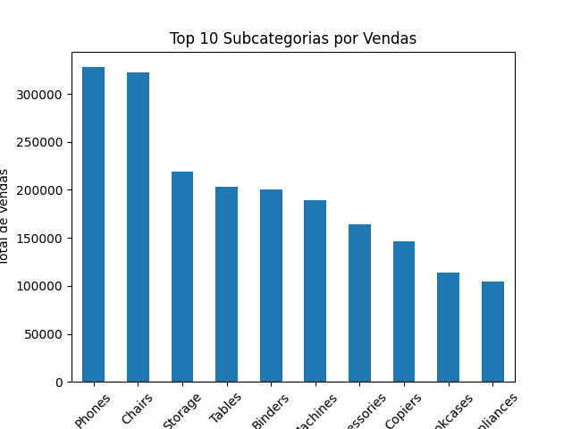
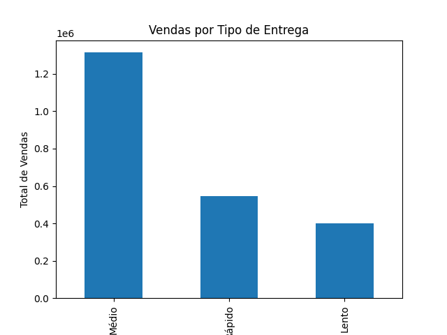

# Análise de Vendas - Superstore

## Objetivo

Realizar uma análise exploratória dos dados de vendas de uma empresa fictícia, com o objetivo de identificar padrões de comportamento, regiões com maior desempenho, categorias mais relevantes e avaliar o impacto do tempo de entrega nas vendas.

---

## Ferramentas utilizadas

* Python
* Pandas
* Matplotlib

---

## Estrutura do projeto

* `dados/` → base de dados utilizada
* `imagens/` → gráficos gerados
* `analise.py` → script principal de análise

---

## Análises realizadas

### 1. Vendas por Região

A região Oeste apresentou o maior volume de vendas, seguida de perto pela região Leste.
A região Sul apresentou desempenho significativamente inferior.

Visualização:

---

### 2. Vendas por Categoria e Região

A categoria **Tecnologia** lidera as vendas em todas as regiões, evidenciando sua importância estratégica.
A região Oeste apresenta maior equilíbrio entre as categorias, enquanto a região Sul possui menor volume geral.

---

### 3. Vendas por Subcategoria

As subcategorias com maior volume de vendas são:

* Phones
* Chairs
* Storage

Observa-se forte concentração de receita nessas categorias, enquanto itens como Fasteners e Labels possuem baixa representatividade.

Visualização:

---

### 4. Análise do Tempo de Entrega

A maior parte das entregas ocorre entre 3 e 5 dias, com média aproximada de 4 dias.

Ao analisar o impacto do tempo de entrega nas vendas:

* Pedidos com entrega **média (3–5 dias)** apresentam maior volume de vendas
* Entregas muito rápidas não representam o maior volume
* Entregas lentas apresentam menor desempenho

Visualização:

---

## Principais Insights

* A receita está concentrada nas regiões Oeste e Leste
* A categoria Tecnologia é o principal motor de vendas
* Há forte concentração de faturamento em poucas subcategorias
* O tempo de entrega, dentro de um intervalo razoável, não é o principal fator de decisão de compra

---

## Conclusão

A análise permitiu identificar padrões importantes de comportamento de vendas, destacando oportunidades de crescimento em regiões com menor desempenho e reforçando a relevância de determinadas categorias no faturamento da empresa.

---

## Próximos passos (melhorias futuras)

* Criar dashboards interativos (Power BI)
* Aplicar análise preditiva de vendas
* Investigar comportamento de clientes por segmento
